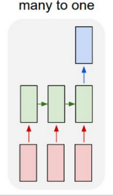
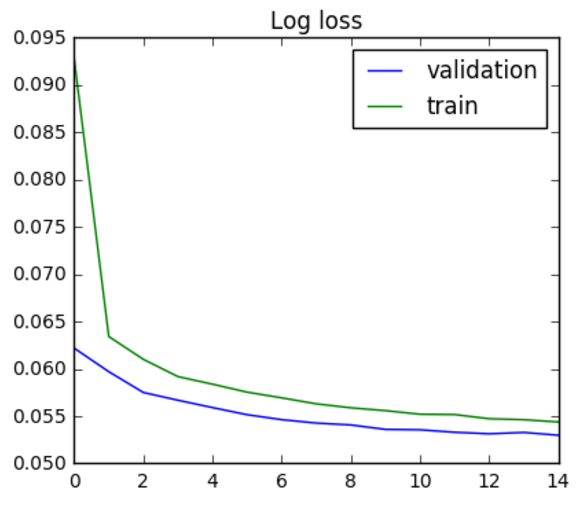

 <p align="center"></p>

This repository contains our contribution to the
[Clue-WATTx hackathon](http://cluehackathon.wattx.io/)

# 1. Usage
## 1.1 Dependencies
The code was developed with python 3.5 and the following libraries and
respective versions :
    - pandas 0.19.2
    - keras 2.0.1
    - tensorflow-gpu 1.0.1 (It can also work with non gpu version)
    - numpy 1.12.0
    - joblib 0.10.3

## 1.2 Training
   First, you have to train the model using the train.py script.

   While
   training, the weights are automatically stored each time the
   validation loss decreases (in the /weights directory).
   The parameters by default train a simple
   LSTM model with  1 layer of 128 neurons over 15 epochs. It uses 100000 sequences
   for training and 50000 for testing. The input and output size is 16
   (i.e. 16 symptoms in input and 16 in output)
   and only batches of 90 days in a row are used for training and
   predicting. The parameters can be tweaked from the command line
   interface :


```bash
$ python train.py --help
usage: train.py [-h] [-N_train N_TRAIN] [-N_test N_TEST] [-N_epochs N_EPOCHS]
                [-batch_size BATCH_SIZE] [-input_size INPUT_SIZE]
                [-output_size OUTPUT_SIZE] [-maxlen MAXLEN]
                [-step_days STEP_DAYS] [-model {1,2}] [-weights WEIGHTS]
                [-debug]

optional arguments:
  -h, --help            show this help message and exit
  -N_train N_TRAIN      Number of users for training dataset
  -N_test N_TEST        Number of users for testing raining dataset
  -N_epochs N_EPOCHS    Number of epochs
  -batch_size BATCH_SIZE
                        Batch size
  -input_size INPUT_SIZE
                        Input size
  -output_size OUTPUT_SIZE
                        Output size
  -maxlen MAXLEN        maxlen
  -step_days STEP_DAYS  STEP_DAYS
  -model {1,2}          1 or 2 layers model
  -weights WEIGHTS      Where to store the weights after training
  -debug                If True, use a reduced subset of the data.
```

## 1.3 Prediction
   After model training, the predictions are made with predict.py.

   It    automatically loads the pretrained weights assuming you use the
   exact same parameters as during training The parameters can be tweaked from the
   command line interface :

```bash
$ python predict.py --help
usage: predict.py [-h] [-input_size INPUT_SIZE] [-output_size OUTPUT_SIZE]
                  [-maxlen MAXLEN] [-model {1,2}] [-weights WEIGHTS]

optional arguments:
  -h, --help            show this help message and exit
  -input_size INPUT_SIZE
                        Input size
  -output_size OUTPUT_SIZE
                        Output size
  -maxlen MAXLEN        maxlen
  -model {1,2}          1 or 2 layers model
  -weights WEIGHTS      Where to store the weights after training
```

# 2. Preprocessing

The preprocessing steps are explained in detail on this notebook:
[1.0-Prepare-training-data](https://github.com/felipeam86/clue_hackathon_code/blob/master/notebooks/1.0-Prepare-training-data.ipynb)

# 3. Modeling
Our solution leverages neural networks, more specifically recurrent neural networks (RNN) with long short term memory (LSTM).
RNNs are well suited to deal with time series, which is why we chose this approach.

## 3.1. Benefits of neural networks
Neural networks offer the benefit of being end-to-end solutions, i.e. if well architectured they deal with the feature
engineering by themselves for the most part. For instance with RNN there is no need to bother whether the user was inactive on a
specific day, or whether she was active but didn't experience a symptom. RNNs will figure this by themselves.

The other benefit is that neural networks often provide better performance than traditional machine learning techniques.
This was observed for image recognition, image caption, speech recognition amongst others.

## 3.2 Drawbacks of neural networks
The main drawback of neural networks is the time it takes to train them. Convergence to a minima can be very time consuming,
in particular for RNNs which consist of many neural networks running in parallel, rapidly growing to millions of parameters to tune.
This has been a big challenge in this competition given the amount of data to process and the timeout set to 2 hours on the statice platform.

Our solution was designed so that the NN can be trained locally and weights are reused without further training on the statice platform.
This speeds up processing, but this also means that training is performed on synthetic data that doesn't necessarily match well the real data.
As a result we observed big discrepancies between local performance and on the statice platform.

Another drawback of NNs is the difficulty to interpret them. With millions of parameters and little human feature engineering,
understanding the logic of how the NN learns and predicts can be nearly impossible. With increasing concerns for transparency and new
EU regulations soon to be effective, the need to explain clearly the automated decisions may prevent the use of NNs in certain situations.
However, this is not an issue in this particular case, as the RNNs are not used to take decision, only as a suggestion engine of plausible
experienced symptoms throughout the cycle.

## 3.3 Architecture
We chose to explore two main architectures: 1 LSTM layer with 128 cells and 2 LSTM layers with 256 cells.

<p align="center"></p>
<p align="center">Illustration of a multi input/single output lstm</p>

Our RNNs are trained with a history of n days (by default 90) describing symptoms experienced by users (the input X), and the labels are
the symptoms experiences by the same users on the n+1 day (the output y)

Given the amount of users and length of the history, ideally we would like to train our network on all sequences of 90+1 days for every
woman, however this would generate too much data. Therefore we limit the number of training sequences to 100000 by default (but
this can be increased) and we chose to skip m (by default 3) days of history for which women. In other words, we look at sequence
1 to 90, then 4 to 93, then 7 to 96 etc.

Other parameters involve the amount of symptoms to be predicted (by default 16, and we never modified that value), as
well as the number of symptoms + other data to be used as input (by default the same 16 symptoms, but can be increase to
the full 81 symptoms, and more data such as day in cycle, whether user is experiencing her periods etc) can be taken into account.

Finally the number of epochs corresponds to the number of times the NN will see the full set of training sequences. Typically we observe
that for a number of epochs the training and validation loss both decrease, then we reach a point where validation loss stagnates, and
finally the validation loss increases while the training loss keeps decreasing. This last phase corresponds to overfitting, and at that
point it is better to stop the training. We setup the network so the NN weights are saved only when the validation loss improves, so
keeping training after reaching the overfit phase doesn't harm the model, but it is a pure waste of time.

## 3.4 Performance
On local machines the performance of RNN looked very promising. We used a PC with 16Gb RAM and a GPU GTX 960M to pre-train the models.
With the default parameters, the RNN took 21 minutes to train and we achieved a log loss on hold out set (validation)
 of 0.0531 after 15 epochs, as shown in the graph below.
 <p align="center"></p>
Using the same weights on the statice platform the obtained log loss is 0.0761

Trained on the statice plateform with the same parameters, we obtain a log loss of 0.0748

There may be several reasons why the performance on the remotely trained model is not as good as the performance on the synthetic data.
The number one assumptions is that locally 100,000 sequences corresponds to a representative portion of the users, however remotely
this may cover a smaller part of all users, therefore the parameter N_train should be increased to train on more samples.

# 4. Next steps
## 4.1 Add additional variables
Our solution didn't take into account several variables made available to us, in particular specifics about the user such as
age, weight, country etc. These information are most probably meaningful and could help improve performance

Also our intuition is that adding an additional variable "last day of cycle" would greatly help the RNN to improve prediction
on the first few days of the next cycle.

## 4.2 Improve the RNN architecture
There are two obvious areas where the RNN can be improved.

The first one is linked to the regularization technique. We used simple dropout of 50%, but it is know that for RNNs dropout
should only be applied to non recurrent layers, as described in this [paper](https://arxiv.org/pdf/1409.2329.pdf)

The second one is connected to statefulness of RNNs. Our RNN is stateless, however we are processing sequences which are related
to each other, therefore at training time we could use statefulness to improve network.

## 4.3 Test the solution on a remote platform equipped with GPU
Most of our attempt to train the RNN on the statice platform failed due to the the 2 hours timeout, whereas they were
executing successfully locally on a PC equipped with GPU. Having a remote environment running a GPU would allow remote training
and would very likely lead to performances equivalent to those observed locally.

# 5. Lessons learned
This competition was the first hackathon that all members of the team ever attended. It has been a lot of fun, a lot of effort
and came with numerous teachings. Here are some of them

## 5.1 Neural networks
We loved working with RNNs. They are state of the art and the way forward for many applications. Despite the lack of results on the
statice platform, the good results we obtained locally give us confidence that they are the right way to deal with the challenge
proposed by clue.

We will keep learning about them and experimenting them in future assignments.

## 5.2 Statice plateform
Working with the statice platform has been one of our biggest challenge. The platform being new, there are lots of adjustments
that can be made, however our main recommendations are the following:
- enable GPU instances for those using RNNs
- enable better tracking/logging of errors to avoid to many back and forth between the developer and the platform administrator
- setup multiple platforms with variable amount of data to enable quicker iterative process during the development phase that requires
intensive testing

Overall we were proud to pioneer the statice platform that will undoubtedly address important privacy concerns that might have held
many companies from sharing their data in competitions.

## 5.3 Clue data
This document referred a lot to the technical approach and little to the data itself. This is in part because the approach we chose
required little engineering of the data itself.

However it is worth mentioning that being purely a team of males, all of us learnt a lot from the initial brief and the data itself.
The breadth of symptoms experienced and reported by women surprised us and definitely give us a better understanding of women around us.

Thank you Clue for collecting this data and using it for the benefit of all!
